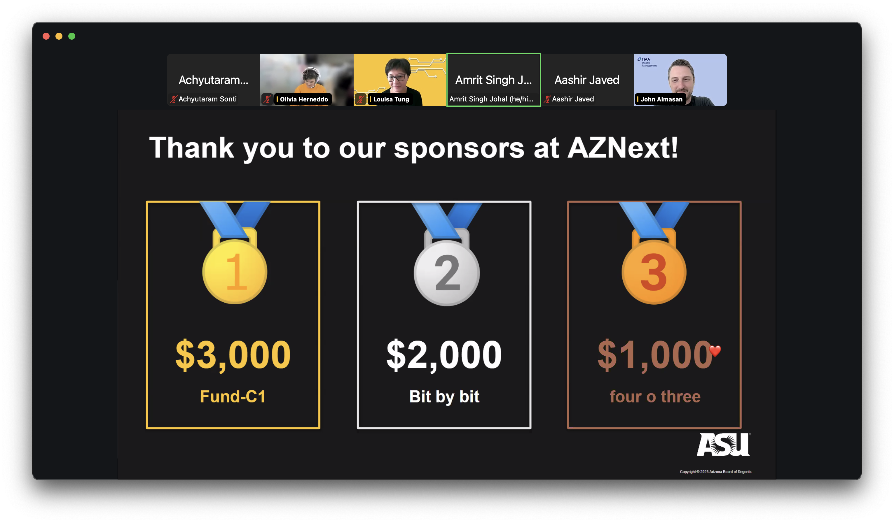
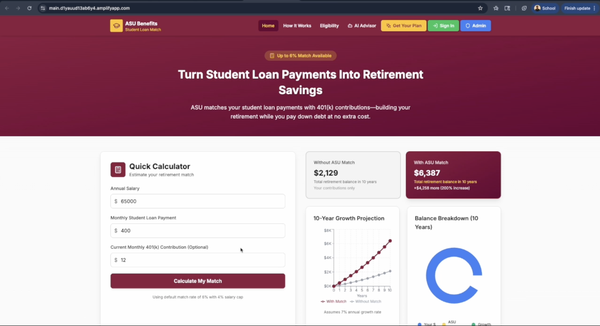

# ASU Student Loan Retirement Match Platform

> **Fund the Future - Spark Challenge 2025**

---

## 🏆 Hackathon Winner

<div align="center">



*Winners of the TIAA x ASU Fund the Future Spark Challenge 2025*

</div>

We are proud to announce that our team won the **TIAA x ASU Fund the Future Spark Challenge 2025** with this innovative student loan retirement match platform!


---

## Transforming Student Loan Payments into Retirement Savings

### 📹 Demo Video

[](https://www.youtube.com/watch?v=KOsUvwRjW88 "Click to watch our platform demo")

*Click the thumbnail above to watch our 72-hour hackathon demo*

---

### 📸 Platform Screenshots

<div align="center">


*Employee Dashboard - Interactive Calculator & AI Assistant*

<br/><br/>


*Admin Analytics Dashboard - Engagement & ROI Metrics*

</div>

---


## Table of Contents

- [Overview](#overview)
- [Problem Statement](#problem-statement)
- [Team](#team)
- [Deployed Website URL](#deployed-website-url)
- [Our Solution](#our-solution)
- [Key Features](#key-features)
  - [For Employees](#for-employees)
  - [For Administrators](#for-administrators)
- [Tech Stack](#tech-stack)
- [Project Structure](#project-structure)
- [Getting Started](#getting-started)
- [Database Setup](#database-setup)
- [Current Infrastructure Reference](#current-infrastructure-reference)
- [Websocket API Details](#websocket-api-details)
- [REST API Details](#rest-api-details)
- [Key Components](#key-components)
- [User Journey](#user-journey)
- [Security Features](#security-features)
- [Acknowledgments](#acknowledgments)

---

## Overview

The ASU Student Loan Retirement Match Platform is a comprehensive web application that empowers ASU employees to understand, calculate, and maximize their SECURE 2.0 student loan matching benefits. Our dual-interface system educates employees through interactive tools while providing administrators with data-driven insights to optimize program performance.

## Problem Statement

ASU employees with student loan debt often forgo retirement contributions to manage loan payments, missing out on employer matching benefits. This creates a retirement savings gap, particularly for younger employees who need compound growth most. Current systems lack user-friendly tools and fail to communicate the value of SECURE 2.0 student loan matching provisions.


## Our Solution

Our solution educates employees on SECURE 2.0 via quick calculations, visualizations, and AI insights, driving enrollment. Post-enrollment, users track retirement growth via dashboards while admins leverage data insights to optimize the program.

## Team

This project was architected and developed by [Pratiksha Wadibhasme](https://www.linkedin.com/in/pratikshawadibhasme/), [Shivam Sonawane](https://www.linkedin.com/in/shivam-sonawane/) and [Achyutaram Sonti](https://www.linkedin.com/in/asonti/). Thanks to the TIAA x ASU team for their guidance and support.


## Key Features

### For Employees

- **Interactive Benefit Calculator** - Calculate personalized retirement projections in seconds
- **GenAI based chatbot** - FAQs and personalised recommendations
- **Visual Comparisons** - See retirement growth with vs. without matching benefits
- **30-Year Projections** - Line and donut charts showing compound growth
- **AI-Powered Insights** - Personalized financial recommendations
- **Eligibility Checker** - Verify qualification for the program
- **Document Verification** - Submit loan verification documents seamlessly to check for eligibility
- **User Dashboard** - Track retirement growth and matching contributions
- **Educational Resources** - Learn about SECURE 2.0 and program benefits

### For Administrators

- **Admin Dashboard** - Monitor program enrollment and engagement
- **Data Analytics** - Understand employee needs and behavior
- **User Management** - Review and approve employee documents
- **Document Verification** - Process loan verification submissions
- **Performance Metrics** - Track program effectiveness and ROI
- **Budget Tracking & Forecasting** - Track and Forecast budget utilization
- **User Engagement Analytics** - Monitor how employees interact with the platform
- **Enrollment Trends** - Analyze enrollment patterns over time
- **Demographic Insights** - Understand user demographics and tailor communications
- **Retention Analysis** - Identify factors influencing continued participation
- **Risk Assessment** - Risk Assessment for Employees

## Tech Stack

### Frontend

- React with TypeScript
- Vite (Build tool)
- TailwindCSS (Styling)
- Recharts (Data visualization)
- React Router (Navigation)
- Lucide React (Icons)

### Backend and Cloud

- Supabase (Database & Authentication)
- Python (Lambda functions and script)
- PostgreSQL (Data storage)
- AWS Lambda (Serverless functions)
- AWS S3 (Document storage)
- AWS DybamoDB (NoSQL database)
- AWS API Gateway (API management)
- AWS CloudWatch (Monitoring & logging)
- AWS Amplify (Hosting & deployment)
- AWS CodeCommit (Version control)

### Dataset

- We have synthesized a dataset based on publicly available data and assumptions to simulate user interactions and program outcomes using Python scripts.
- The dataset is taken from - From https://collegescorecard.ed.gov/data/ which is an official US government website that has most recent data of the student cohort who have student debt and are currently earning.

## Project Structure

```
asu-student-loan-match/
├── backend/
│   └── lambdas/
│       ├── add_user_profile_lambda/
│       │   ├── bcrypt/
│       │   ├── bcrypt-5.0.0.dist-info/
│       │   ├── deployment-package.zip
│       │   └── lambda_function.py
│       ├── admin-API/
│       ├── calculate_match_lambda/
│       ├── financial_chatbot_advisor_v2/
│       ├── rag-get-presigned-url/
│       ├── rag-process-document-1/
│       └── apigateway-trust-policy.json
├── dist/
├── node_modules/
├── scripts/
├── src/
│   ├── components/
│   │   ├── Header.tsx
│   │   ├── Footer.tsx
│   │   ├── FAQAccordion.tsx
│   │   └── PersonalizedInsights.tsx
│   ├── pages/
│   │   ├── Home.tsx
│   │   ├── Calculator.tsx
│   │   ├── Eligibility.tsx
│   │   ├── HowItWorks.tsx
│   │   └── GetStarted.tsx
│   ├── utils/
│   │   └── calculator.ts
│   ├── lib/
│   │   └── supabase.ts
│   ├── types.ts
│   ├── App.tsx
│   └── main.tsx
├── .env
├── .gitignore
├── eslint.config.js
├── index.html
├── package.json
├── package-lock.json
├── postcss.config.js
├── ReadMe.md
├── requirements.txt
├── tailwind.config.js
├── tsconfig.app.json
└── tsconfig.json
├── vite.config.ts
└── README.md
```

## Getting Started

### Prerequisites

- Node.js (v18 or higher)
- Python 3.11 or higher
- AWS CLI configured
- AWS account with necessary permissions
- npm
- Supabase account

### Installation

**1. Clone the repository:**

```
git clone https://git-codecommit.us-east-1.amazonaws.com/v1/repos/ASU-LOAN-REPAYMENT
cd asu-loan-repayment
```

**2. Install dependencies:**

```
npm install
```

**3. Set up environment variables:**

Create a `.env` file in the root directory:

```
VITE_SUPABASE_URL=your_supabase_url
VITE_SUPABASE_ANON_KEY=your_supabase_anon_key
```

**4. Run the development server:**

```
npm run dev
```

**5. Open in browser:**

Navigate to `http://localhost:5173`

## Database Setup

### Supabase Tables

**calculator_results:**

- `id` (uuid, primary key)
- `user_id` (uuid, foreign key)
- `annual_salary` (numeric)
- `monthly_loan_payment` (numeric)
- `monthly_401k_contribution` (numeric)
- `match_percentage` (numeric)
- `match_cap` (numeric)
- `created_at` (timestamp)

**user_profiles:**

- `id` (uuid, primary key)
- `email` (text)
- `full_name` (text)
- `enrollment_status` (text)
- `created_at` (timestamp)

## Current Infrastructure Reference

- Lambda Functions:
  - `add_user_profile_lambda` 
  - `admin-API`
  - `calculate_match_lambda`
  - `financial_chatbot_advisor_v2`
  - `rag-get-presigned-url`
  - `rag-process-document-1`
  
- REST APIs:
  - `admin-rest-api`
  - `ASU-UserProfile-API`
  - `FileUploadAPI`
  - `loan-document-processor-api`
  - `student-loan-match-api`

- WebSocket APIs: 
  - `ASU-Financial-Advisor-WebSocket`

- S3 Buckets:
  - `asu-hackathon-bucket-029756585142`
  - `doc-upload-bucket-11`
  
- DynamoDB Tables:
  - `asu-user-profiles` (To store user profiles)
  - `chatbot-connections`
  - `chatbot-sessions`

## Websocket API Details
### Websocket API for chatbot
- **Routes**: $connect, message, $disconnect, $default

## REST API Details

### Get all employee insights for admin
- **Resources**:
  - `/admin/insights` - GET method 

### Get all users for admin
- **Resources**:
  - `/admin/users` - GET method

### Get user by asuId for admin
- **Resources**:
  - `/admin/users/{asuId}` - GET method

### Get User Documents by asuId for admin
- **Resources**:
  - `/admin/users/{asuId}/documents` - GET method

### Get User Status by asuId for admin
- **Resources**:
  - `/admin/users/{asuId}/status` - GET method

### Update Approval Status by asuId for admin
- **Resources**:
  - `Update Approval Status` - POST method

### Create Profile for Users
- **Resources**:
  - `/user-profile` - POST method

### Document Extraction API
- **Resources**:
  - `/process-documents` - POST method
  - `/get-upload-urls` - POST method

### Calculate Match API
- **Resources**:
  - `/calculate-match` - POST method

## Security Features

- Supabase Authentication (Row Level Security)
- Secure document upload with encryption
- Environment variable protection
- Input validation and sanitization

## Demo Video

Long Format Demo: https://youtu.be/3bX1j1JH3K4

## Acknowledgments

- TIAA x ASU for sponsoring the Fund the Future Spark Challenge'25

---
